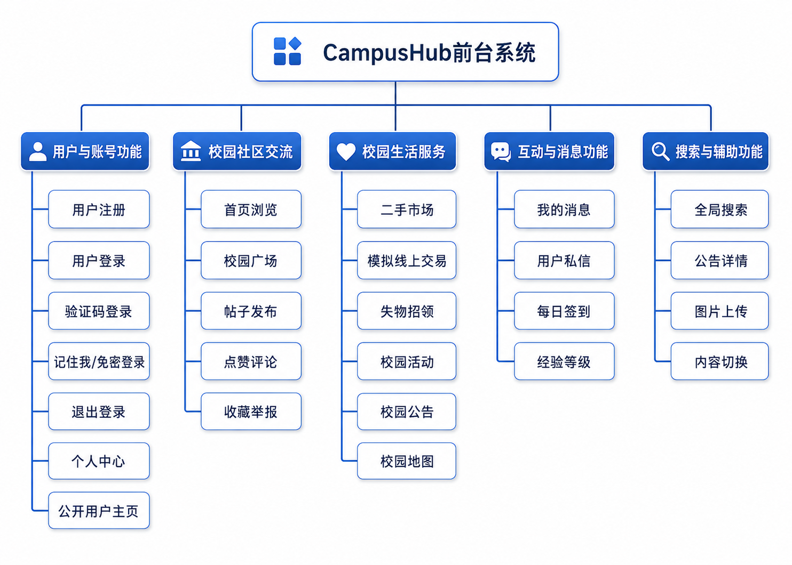
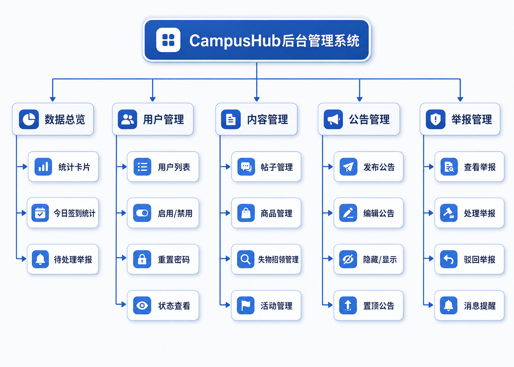
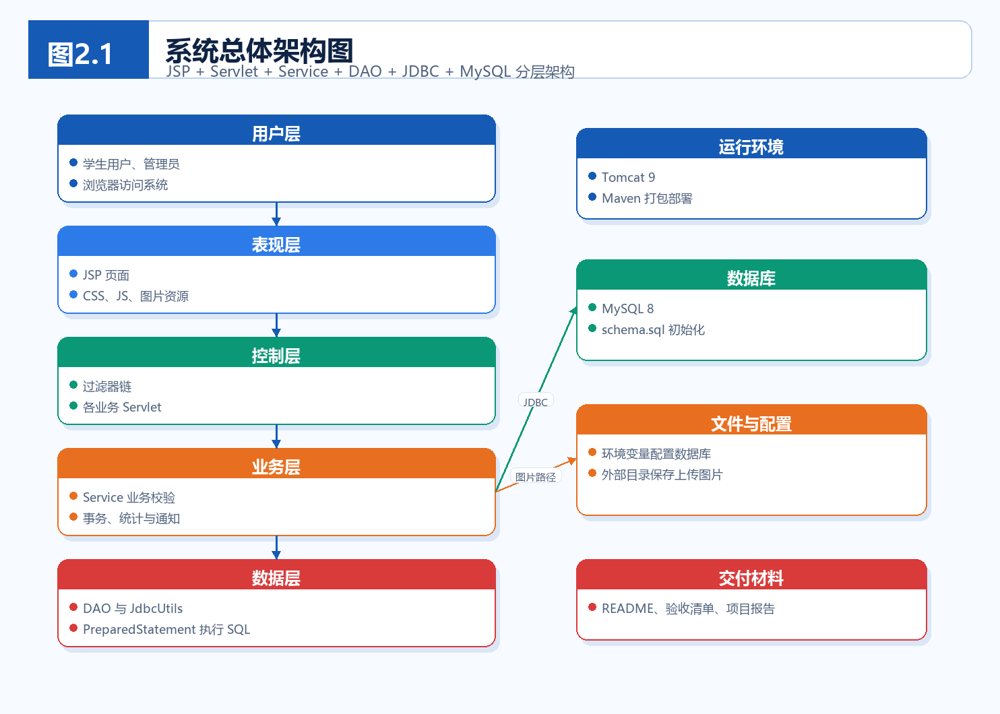
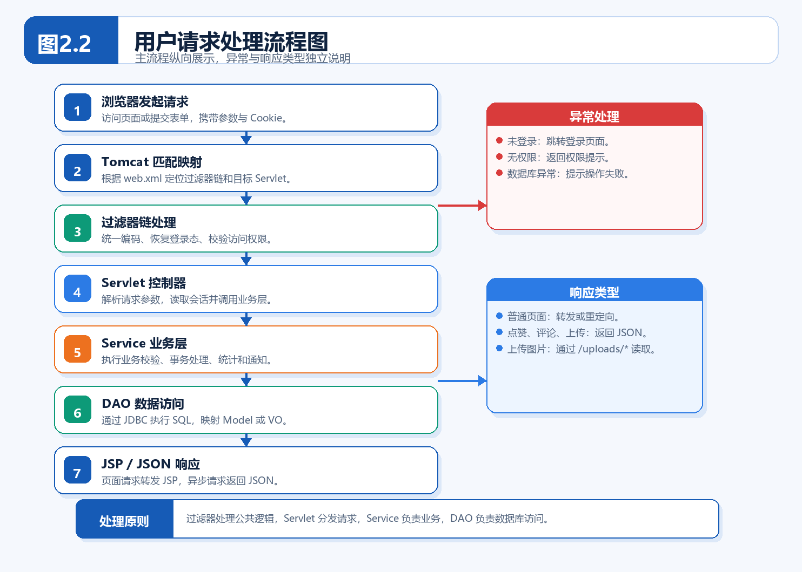
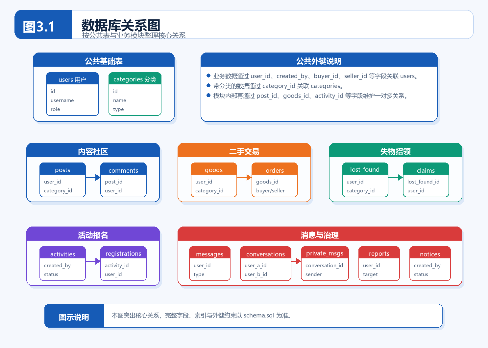
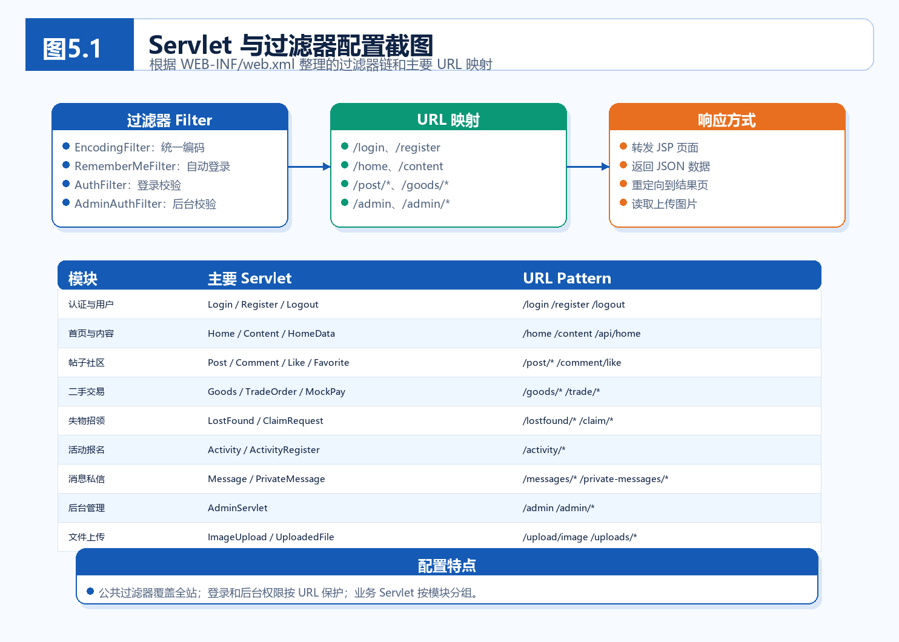

# CampusHub

CampusHub 是一个面向 Java Web 综合实训和项目答辩的校园服务平台。系统围绕校园社区广场展开，整合了帖子交流、二手交易、失物招领、活动报名、公告通知、私信消息、全局搜索、每日签到、经验等级和后台审核等功能。

英文文档见 [README.md](README.md)。

## 项目亮点

- 使用传统 Java Web 技术栈：JSP、Servlet、Service、DAO、JDBC、MySQL。
- 覆盖学生端常见业务：注册登录、发帖评论、点赞收藏、举报、二手商品、模拟支付、失物认领、活动报名、通知和私信。
- 覆盖后台管理业务：数据统计、用户管理、内容审核、公告管理、举报处理。
- 同时提供正式交付还原脚本和开发空库初始化脚本。
- 上传图片保存到外部持久目录，避免 Maven 构建或 Tomcat 重新部署后丢失。
- 包含服务层和工具类单元测试，便于交付前验证。

## 功能概览

### 学生端

- 用户注册、验证码登录、退出登录、记住我登录。
- 首页信息流、公告、活动推荐、失物招领动态。
- 校园广场、发帖、评论、点赞、收藏、举报。
- 二手商品发布、筛选、编辑、收藏、状态管理、联系卖家和模拟二维码支付。
- 失物招领发布、认领申请和认领处理。
- 活动发布、报名、取消报名、截止时间和人数限制。
- 每日签到、连续签到、经验值和等级。
- 个人中心、个人内容、购买记录、公开用户主页。
- 系统通知、未读数、一对一私信、全局搜索。
- 账号注销，包含密码确认、匿名化和相关数据清理。



### 后台管理

- 平台数据总览。
- 用户启用、禁用、状态查看和密码重置。
- 帖子、商品、失物招领和活动内容审核。
- 公告发布、编辑、隐藏、显示和置顶。
- 举报查看、处理、驳回和被举报内容管理。
- 管理员权限过滤和举报消息提醒。



## 技术栈

| 类型 | 技术 |
| --- | --- |
| 后端 | Java 21、Servlet 4.0、JSP、JDBC |
| 前端 | HTML、CSS、JavaScript、Fetch API |
| 数据库 | MySQL 8 |
| Web 容器 | Apache Tomcat 9 |
| 构建工具 | Maven |
| 安全 | BCrypt、Session、Cookie、验证码、Remember Me Token |
| 二维码 | ZXing |
| 测试 | JUnit 5 |

本项目使用 `javax.servlet` API，建议部署到 Tomcat 9。Tomcat 10 及以上默认使用 `jakarta.servlet`，不能直接兼容。

## 系统架构

后端采用 `Servlet -> Service -> DAO -> Model` 分层结构。JSP 负责页面渲染，JavaScript 和 Fetch API 负责局部异步交互。



请求处理流程经过 Tomcat 映射、过滤器、Servlet 控制器、业务层、DAO 和 MySQL。



## 数据库模型

`users` 是系统核心用户表。帖子、评论、商品、订单、失物招领、认领申请、活动报名、消息、举报和公告等业务数据都围绕用户关系展开。



主要数据表如下：

```text
users, categories, posts, comments, likes, favorites, goods,
lost_found, claim_requests, activities, activity_registrations,
notices, checkins, messages, reports, remember_tokens,
private_conversations, private_messages, user_experience_logs,
goods_orders, account_cancel_logs
```

## 项目结构

```text
CampusHub/
|-- database/
|   |-- demo-data.sql              # 可选演示数据
|   `-- migrations/                # 历史增量迁移说明
|-- docs/
|   |-- acceptance-checklist.md     # 本地验收清单
|   |-- figures/                   # 报告插图
|   `-- images/                    # README 图片
|-- src/
|   |-- main/
|   |   |-- java/cn/campushub/
|   |   |   |-- config/            # 数据库配置
|   |   |   |-- constant/          # 公共常量
|   |   |   |-- dao/               # DAO 接口和 JDBC 实现
|   |   |   |-- filter/            # 编码与权限过滤器
|   |   |   |-- model/             # 实体、VO 和结果对象
|   |   |   |-- service/           # 业务服务
|   |   |   |-- servlet/           # 请求控制器
|   |   |   `-- util/              # 校验、密码、JSON、二维码、上传工具
|   |   |-- resources/
|   |   |   |-- database.properties
|   |   |   `-- database/
|   |   |       |-- campushub.sql    # 当前 MySQL 导出的正式交付脚本
|   |   |       `-- schema.sql      # 开发空库初始化脚本
|   |   `-- webapp/
|   |       |-- WEB-INF/views/      # JSP 页面和片段
|   |       |-- css/
|   |       |-- js/
|   |       `-- images/
|   `-- test/java/cn/campushub/     # 单元测试
|-- database-schema.md
|-- pom.xml
|-- README.md
`-- README-ZN.md
```

## 环境要求

- JDK 21 或更高版本
- Maven 3.9+
- MySQL 8.0+
- Apache Tomcat 9.0+
- 可选：IntelliJ IDEA，用于本地 Tomcat 部署和调试

## 数据库初始化

正式交付和答辩演示时，优先使用当前 MySQL 导出的完整脚本还原数据库：

```sql
CREATE DATABASE IF NOT EXISTS campushub
  DEFAULT CHARACTER SET utf8mb4
  COLLATE utf8mb4_unicode_ci;
USE campushub;
SOURCE C:/Users/1/IdeaProjects/CampusHub/src/main/resources/database/campushub.sql;
```

`src/main/resources/database/campushub.sql` 是正式交付推荐脚本，来自当前本地 MySQL 数据库导出，包含当前表结构和演示数据。

该导出脚本本身不创建数据库，执行前需要先运行 `CREATE DATABASE` 和 `USE campushub`。

如果只是开发调试，需要从空库初始化基础结构，可以执行：

```sql
SOURCE C:/Users/1/IdeaProjects/CampusHub/src/main/resources/database/schema.sql;
```

`src/main/resources/database/schema.sql` 会创建数据库、当前所有业务表、索引、外键和基础分类数据。

`database/migrations/` 目录保留为已有数据库的历史增量变更记录。正式交付使用 `campushub.sql`；开发空库初始化使用 `schema.sql`。

如果本地数据库中已经存在演示用户，可以执行演示数据脚本：

```sql
SOURCE C:/Users/1/IdeaProjects/CampusHub/database/demo-data.sql;
```

项目不内置固定管理员账号。可以先注册普通用户，再在 MySQL 中提升权限：

```sql
UPDATE users
SET role = 'admin'
WHERE username = 'your_username';
```

## 配置说明

默认数据库配置文件位于：

```text
src/main/resources/database.properties
```

仓库中的配置文件不应保存真实密码。本地数据库密码应通过环境变量或 JVM 系统属性提供。

### 环境变量

| 变量名 | 说明 |
| --- | --- |
| `CAMPUSHUB_DB_DRIVER` | JDBC 驱动，通常为 `com.mysql.cj.jdbc.Driver` |
| `CAMPUSHUB_DB_URL` | MySQL JDBC 连接地址 |
| `CAMPUSHUB_DB_USERNAME` | 数据库用户名 |
| `CAMPUSHUB_DB_PASSWORD` | 数据库密码 |
| `CAMPUSHUB_UPLOAD_DIR` | 用户上传图片的外部保存目录 |
| `CAMPUSHUB_PUBLIC_BASE_URL` | 手机扫码支付页面使用的公网或局域网基础地址 |

PowerShell 示例：

```powershell
$env:CAMPUSHUB_DB_URL="jdbc:mysql://localhost:3306/campushub?useUnicode=true&characterEncoding=UTF-8&serverTimezone=Asia/Shanghai&useSSL=false&allowPublicKeyRetrieval=true"
$env:CAMPUSHUB_DB_USERNAME="root"
$env:CAMPUSHUB_DB_PASSWORD="your_password"
$env:CAMPUSHUB_UPLOAD_DIR="C:\CampusHub\uploads"
```

如果没有设置 `CAMPUSHUB_DB_PASSWORD`，且 `db.password` 仍为 `PLEASE_SET_ENV`，应用会直接报配置错误，而不是使用占位密码连接数据库。

### IntelliJ IDEA Tomcat 配置

如果 IDEA 启动的 Tomcat 读不到系统环境变量，可以在 Tomcat 运行配置的 VM options 中加入：

```text
-Dcampushub.db.url=jdbc:mysql://localhost:3306/campushub?useUnicode=true&characterEncoding=UTF-8&serverTimezone=Asia/Shanghai&useSSL=false&allowPublicKeyRetrieval=true
-Dcampushub.db.username=root
-Dcampushub.db.password=your_password
-Dcampushub.upload.dir=C:\CampusHub\uploads
```

## 上传图片

上传文件不会保存在 WAR 或 exploded 部署目录中，而是保存到外部目录。

优先级如下：

1. JVM 参数 `campushub.upload.dir`
2. 环境变量 `CAMPUSHUB_UPLOAD_DIR`
3. 默认目录 `%USERPROFILE%\CampusHub\uploads`

对外访问路径保持为：

```text
/uploads/{type}/{filename}
```

`UploadedFileServlet` 会从外部上传目录读取文件。该目录应放在 Tomcat `webapps` 和 Maven `target` 之外，避免重新构建或重新部署后图片丢失。

## 构建与测试

运行单元测试：

```shell
mvn "-Dmaven.repo.local=target\m2" test
```

打包 WAR：

```shell
mvn "-Dmaven.repo.local=target\m2" -DskipTests package
```

生成结果：

```text
target/CampusHub.war
```

## 部署方式

### 正式交付部署

1. 安装 JDK 21+、Maven 3.9+、MySQL 8.0+ 和 Apache Tomcat 9。
2. 创建并选择 `campushub` 数据库，然后还原正式交付脚本：

   ```sql
   CREATE DATABASE IF NOT EXISTS campushub
     DEFAULT CHARACTER SET utf8mb4
     COLLATE utf8mb4_unicode_ci;
   USE campushub;
   SOURCE C:/Users/1/IdeaProjects/CampusHub/src/main/resources/database/campushub.sql;
   ```

3. 配置运行时数据库连接。PowerShell 示例：

   ```powershell
   $env:CAMPUSHUB_DB_URL="jdbc:mysql://localhost:3306/campushub?useUnicode=true&characterEncoding=UTF-8&serverTimezone=Asia/Shanghai&useSSL=false&allowPublicKeyRetrieval=true"
   $env:CAMPUSHUB_DB_USERNAME="root"
   $env:CAMPUSHUB_DB_PASSWORD="your_password"
   $env:CAMPUSHUB_UPLOAD_DIR="C:\CampusHub\uploads"
   ```

4. 构建并验证项目：

   ```shell
   mvn "-Dmaven.repo.local=target\m2" test
   mvn "-Dmaven.repo.local=target\m2" -DskipTests package
   ```

5. 将 `target/CampusHub.war` 部署到 Tomcat 9 的 `webapps` 目录，或在 IntelliJ IDEA 中部署 `CampusHub:war exploded`。
6. 启动 Tomcat 后访问：

   ```text
   http://localhost:8080/CampusHub/
   ```

### IntelliJ IDEA Tomcat 部署

1. 使用 IntelliJ IDEA 打开项目。
2. 将 Project SDK 配置为 JDK 21 或更高版本。
3. 在 Run/Debug Configurations 中添加本地 Tomcat 9。
4. 在 Deployment 选项卡中添加 `CampusHub:war exploded`。
5. 通过环境变量或 VM options 配置数据库和上传目录。
6. 启动 Tomcat 运行配置。

### WAR 包部署

1. 构建 `target/CampusHub.war`。
2. 将 WAR 复制到 Tomcat 9 的 `webapps` 目录。
3. 启动 Tomcat。
4. 浏览器访问 `/CampusHub/`。

常用入口：

| 页面 | URL |
| --- | --- |
| 首页 | `/CampusHub/` |
| 登录 | `/CampusHub/login` |
| 注册 | `/CampusHub/register` |
| 后台 | `/CampusHub/admin` |
| 私信 | `/CampusHub/private-messages` |

Servlet 与过滤器配置摘要：



## 本地验收

答辩或评分前建议执行：

```text
docs/acceptance-checklist.md
```

验收清单覆盖：

- 空 MySQL 数据库初始化。
- 环境变量或 VM options 配置。
- Maven 测试与打包。
- Tomcat 部署。
- 注册、登录、发帖、评论、点赞、收藏。
- 商品发布和模拟支付。
- 失物招领认领。
- 活动报名。
- 通知、私信、搜索和后台审核。

## 模拟二维码支付

支付流程仅用于课程项目演示，不调用微信支付接口，也不会发生真实资金交易。

如果需要用手机扫码：

1. 手机和服务器连接到同一局域网。
2. 设置 `CAMPUSHUB_PUBLIC_BASE_URL` 为手机可访问的地址：

   ```powershell
   $env:CAMPUSHUB_PUBLIC_BASE_URL="http://192.168.1.100:8080"
   ```

3. 重启 Tomcat，再创建新的订单二维码。

给手机扫码时不要使用 `localhost`。

## 安全说明

- 密码使用 BCrypt 哈希保存。
- Remember Me Cookie 不保存明文密码。
- SQL 使用参数化 `PreparedStatement`。
- 普通登录用户和管理员路径由不同过滤器保护。
- 账号注销采用软删除、匿名化和相关数据清理。
- 真实数据库密码应只保存在本地环境中，不能提交到仓库。

## 相关文档

- [数据库结构说明](database-schema.md)
- [本地验收清单](docs/acceptance-checklist.md)
- [源码文件说明](CODE_FILES.md)

## 局限性

CampusHub 是 Java Web 课程项目。模拟支付、单机 Session 和本地上传目录适合课程演示，但不能直接替代生产环境中的真实支付、分布式会话和对象存储。
