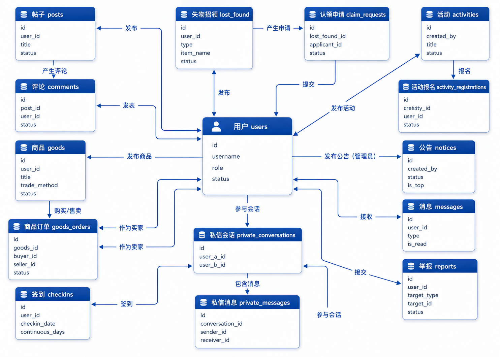
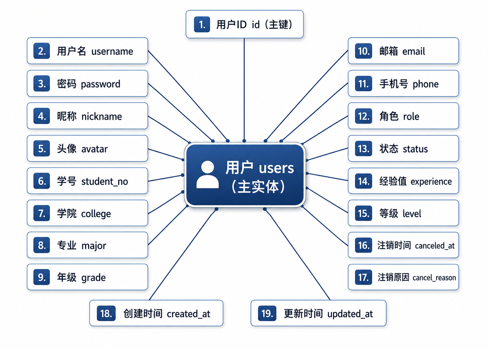

# CampusHub

CampusHub is an integrated campus community platform for students and administrators. Centered around a campus social feed, it combines community posts, second-hand trading, lost-and-found services, campus activities, announcements, messaging, global search, daily check-ins, user levels, and administrative moderation in one system.

## Features

### Student-Facing System

- User registration, CAPTCHA login, logout, and Remember Me authentication
- Home feed, campus map, announcements, activity recommendations, and lost-item updates
- Campus square, post publishing, comments, likes, favorites, and reports
- Second-hand item publishing, filtering, editing, favorites, status management, and seller messaging
- Offline trading and simulated QR-code payment with order and item status transitions
- Lost-and-found publishing, claim requests, and claim processing
- Campus activity publishing, registration, cancellation, deadlines, and capacity limits
- Daily check-ins, consecutive-day tracking, experience points, and user levels
- Personal profile, user-generated content, purchase history, and public user pages
- System notifications, unread counters, and one-to-one private messaging
- Global search across posts, goods, lost-and-found records, activities, and announcements
- Account soft deletion with password confirmation, anonymization, and related-data cleanup


### Administration System

- Platform statistics dashboard
- User activation, suspension, status inspection, and password reset
- Post, goods, lost-and-found, and activity moderation
- Announcement publishing, editing, visibility control, and pinning
- Report review, approval, rejection, and reported-content moderation
- Administrator authorization filters and report notifications


## Technology Stack

| Category | Technology |
| --- | --- |
| Backend | Java 21, Servlet 4.0, JSP, JDBC |
| Frontend | HTML, CSS, JavaScript, Fetch API |
| Database | MySQL 8 |
| Web Container | Apache Tomcat 9 |
| Build Tool | Maven 3.9+ |
| Security | BCrypt, Session, Cookie, CAPTCHA, Remember Me Token |
| QR Codes | ZXing 3.5.3 |
| Testing | JUnit 5 |

The project follows a traditional Java Web stack without Spring, Vue, or React. Its SPA-Lite interface uses `ContentServlet` to load JSP fragments dynamically, while the Fetch API handles partial asynchronous updates.

## Architecture

```text
Browser
  |
  +-- JSP / CSS / JavaScript
  |
Filters (encoding, login restoration, user authorization, admin authorization)
  |
Servlets (request handling and view dispatch)
  |
Services (validation and business rules)
  |
DAO / JDBC (SQL and transactions)
  |
MySQL
```

The backend follows a `Servlet -> Service -> DAO -> Model` structure. Database access uses parameterized `PreparedStatement` queries. Multi-table operations such as simulated payments, activity registration, check-in experience updates, and account cancellation use JDBC transactions to maintain consistency.

## Database Model

The `users` table is the central entity. It connects community content, marketplace orders, lost-and-found claims, activity registrations, notifications, private conversations, reports, and check-ins.



The primary user entity stores identity, academic profile, account status, experience, level, and soft-deletion metadata.



## Project Structure

```text
CampusHub/
|-- database/
|   `-- migrations/             # Incremental database migrations
|-- docs/
|   `-- images/                 # README diagrams
|-- src/
|   |-- main/
|   |   |-- java/cn/campushub/
|   |   |   |-- config/        # Database configuration
|   |   |   |-- constant/      # Shared constants
|   |   |   |-- dao/           # DAO interfaces and JDBC implementations
|   |   |   |-- filter/        # Encoding and authorization filters
|   |   |   |-- model/         # Entities, view objects, and result models
|   |   |   |-- service/       # Business services
|   |   |   |-- servlet/       # Web request controllers
|   |   |   `-- util/          # Validation, password, JSON, and QR utilities
|   |   |-- resources/
|   |   |   |-- database.properties
|   |   |   `-- database/schema.sql
|   |   `-- webapp/
|   |       |-- WEB-INF/views/ # JSP pages and fragments
|   |       |-- css/
|   |       |-- js/
|   |       `-- images/
|   `-- test/java/cn/campushub/ # Service and utility unit tests
|-- database-schema.md          # Complete current database specification
|-- pom.xml
`-- README.md
```

## Requirements

- JDK 21
- Maven 3.9+
- MySQL 8.0+
- Apache Tomcat 9.0+

This project uses `javax.servlet` and should be deployed on Tomcat 9. Tomcat 10 and later use `jakarta.servlet` by default and are not directly compatible.

## Database Setup

The database is named `campushub` and contains the following main tables:

```text
users, categories, posts, comments, likes, favorites, goods,
lost_found, claim_requests, activities, activity_registrations,
notices, checkins, messages, reports, remember_tokens,
private_conversations, private_messages, user_experience_logs,
goods_orders, account_cancel_logs
```

1. Create a MySQL database named `campushub`.
2. Create the business tables according to [database-schema.md](database-schema.md).
3. If the `goods` table does not contain the transaction-method field, run:

   ```sql
   SOURCE database/migrations/20260610_add_goods_trade_method.sql;
   ```

> `src/main/resources/database/schema.sql` is an earlier base schema and does not contain every table and field used by the current application. Use `database-schema.md` together with `database/migrations/` when reproducing the current database.

The repository does not include a fixed administrator account. Register a normal user first, then promote that account in MySQL:

```sql
UPDATE users
SET role = 'admin'
WHERE username = 'your_username';
```

## Database Configuration

The default connection settings are stored in:

```text
src/main/resources/database.properties
```

Use local configuration or environment variables instead of committing real database credentials:

| Environment Variable | Description |
| --- | --- |
| `CAMPUSHUB_DB_DRIVER` | JDBC driver, normally `com.mysql.cj.jdbc.Driver` |
| `CAMPUSHUB_DB_URL` | MySQL JDBC connection URL |
| `CAMPUSHUB_DB_USERNAME` | Database username |
| `CAMPUSHUB_DB_PASSWORD` | Database password |
| `CAMPUSHUB_PUBLIC_BASE_URL` | Public or LAN base URL used by mobile QR payment pages |

PowerShell example:

```powershell
$env:CAMPUSHUB_DB_URL="jdbc:mysql://localhost:3306/campushub?useUnicode=true&characterEncoding=UTF-8&serverTimezone=Asia/Shanghai&useSSL=false&allowPublicKeyRetrieval=true"
$env:CAMPUSHUB_DB_USERNAME="root"
$env:CAMPUSHUB_DB_PASSWORD="your_password"
```

## Build and Test

Run the unit tests:

```shell
mvn test
```

Build the WAR package:

```shell
mvn clean package
```

The generated deployment artifact is:

```text
target/CampusHub.war
```

## Deployment

1. Copy `target/CampusHub.war` to the Tomcat 9 `webapps` directory.
2. Start Tomcat.
3. Open:

   ```text
   http://localhost:8080/CampusHub/
   ```

Alternatively, configure Tomcat 9 in IntelliJ IDEA and deploy the `CampusHub:war exploded` artifact.

Common entry points:

| Page | URL |
| --- | --- |
| Home | `/CampusHub/` |
| Login | `/CampusHub/login` |
| Registration | `/CampusHub/register` |
| Administration | `/CampusHub/admin` |
| Private Messages | `/CampusHub/private-messages` |

## Simulated QR Payment

The payment workflow is for course-project demonstration only. It does not call the WeChat Pay API or transfer real money.

To scan an order QR code with a phone:

1. Connect the phone and server to the same local network.
2. Set `CAMPUSHUB_PUBLIC_BASE_URL` to an address accessible from the phone:

   ```powershell
   $env:CAMPUSHUB_PUBLIC_BASE_URL="http://192.168.1.100:8080"
   ```

3. Restart Tomcat and create a new order QR code.

Do not use `localhost` in a QR code intended for another device.

## Image Uploads

- Maximum file size: 5 MB
- Maximum request size: 6 MB
- Supported use cases include avatars, post images, goods images, lost-and-found images, and activity covers
- Uploaded files are stored under the expanded Tomcat application's `uploads` directory
- Redeploying or cleaning the application directory may remove uploaded files

This storage approach is suitable for classroom demonstrations. A production deployment should use a persistent external directory or object storage.

## Security and Data Handling

- Passwords are hashed and verified with BCrypt.
- Sessions maintain authenticated user state.
- Remember Me cookies never store plaintext passwords.
- Parameterized SQL queries reduce injection risk.
- Separate filters protect authenticated-user and administrator routes.
- Content removal and account cancellation primarily use status changes, anonymization, and soft deletion.
- Completed orders and report records remain available after account cancellation for traceability.

## Documentation

- [Database Schema Specification](database-schema.md)
- [Source File Reference](CODE_FILES.md)

## Limitations

CampusHub is intended for Java Web coursework and project demonstrations. Simulated payments, application-local upload storage, and single-node sessions are teaching-oriented implementations and should not be used directly in production.

## Acknowledgements

Special thanks to [colbymchenry/codegraph](https://github.com/colbymchenry/codegraph). Its code-intelligence tools reduced token usage and made repository exploration significantly more efficient.
